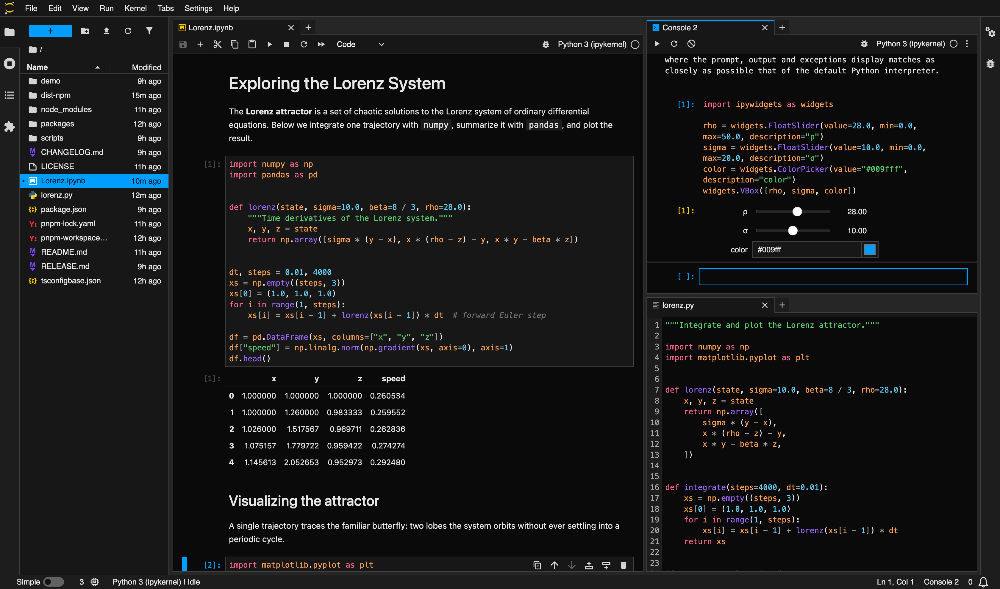

# jupyterlab-pierre-theme

JupyterLab light and dark themes that match the [Pierre](https://pierre.co)
palette, the same colors used by the `@pierre/diffs` viewer.



It was made to fit the work on
[xtralab](https://github.com/jtpio/xtralab), so a JupyterLab workbench and the
git diffs xtralab renders through `@pierre/diffs` read as a single product.

This repository ships two prebuilt JupyterLab themes:

- `jupyterlab-pierre-light`
- `jupyterlab-pierre-dark`

They recolor the whole JupyterLab UI (layout, accents, state colors) and the
CodeMirror editor syntax highlighting so the editor reads as the same product
as a Pierre diff. The themes work in any JupyterLab 4 install.

## Install

```bash
pip install jupyterlab-pierre-light jupyterlab-pierre-dark
```

Then pick "Pierre Light" or "Pierre Dark" from Settings, Theme.

## Color source

The palettes are generated from [`@pierre/theme`](https://www.npmjs.com/package/@pierre/theme),
Pierre's canonical theme package (MIT licensed). `scripts/generate-theme.mjs`
reads `@pierre/theme/themes/pierre-{light,dark}.json` and writes each package's
`style/variables.css`, so the JupyterLab themes track upstream Pierre instead of
drifting from hand-copied hex values. Regenerate with:

```bash
pnpm generate
```

The diff viewer highlights code with Shiki and TextMate grammars, while
JupyterLab highlights the editor with CodeMirror 6 and Lezer. JupyterLab's
default highlight style leaves several tokens uncolored (type and class names,
plain variable references, function calls) and renders keywords bold. To narrow
the gap, each package also ships a small CodeMirror extension (`src/syntax.ts`)
that colors those tokens and softens the keyword weight to match Pierre. Its
colors come from `--jpp-*` variables that only the Pierre themes define, so the
extension is inert under any other theme. The two engines still tokenize
differently, so the editor is a close approximation rather than a pixel-perfect
match; the chrome and the added and deleted colors line up exactly.

## Development

This is a pnpm workspace with one package per theme, built with
`@jupyter/builder`.

```bash
pnpm install
pnpm build
```

Install the packages into a JupyterLab environment for local testing:

```bash
python -m pip install -e packages/jupyterlab-pierre-light
python -m pip install -e packages/jupyterlab-pierre-dark
```

Then reload JupyterLab and select the theme.

## License

BSD-3-Clause. Color values are derived from `@pierre/theme`, which is MIT
licensed.
